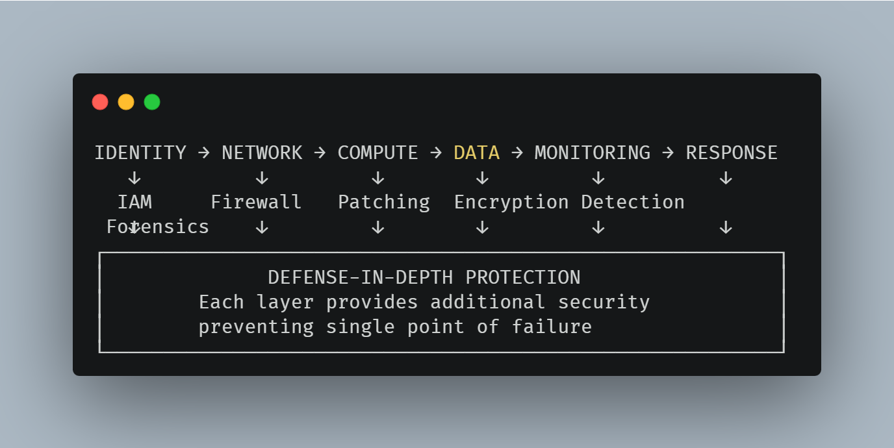

# 🛡️ AWS Security Hardening Suite

## Overview
Comprehensive collection of hands-on security labs implementing defense-in-depth strategy across AWS infrastructure layers. Each lab addresses specific security domains with production-ready configurations.

## 🏗️ Defense-in-Depth Architecture


| Layer | Protection | Lab Implementation |
|-------|------------|-------------------|
| **1. Identity** | IAM & Access Control | IAM Security Lab |
| **2. Network** | Segmentation & Filtering | VPC Security + Network Firewall |
| **3. Compute** | OS Hardening & Patching | EC2 System Hardening |
| **4. Data** | Encryption at Rest | Data Protection Lab |
| **5. Monitoring** | Threat Detection | Security Monitoring Lab |
| **6. Response** | Incident Handling | CloudTrail Forensics |

## 🔗 Lab Repository

### 1. [AWS EC2 System Hardening](https://github.com/SilentVeil/aws-ec2-patch-management-system)
**Focus:** Automated patch management, CIS compliance, OS security hardening
**Skills:** Systems Manager, Patch Manager, Compliance reporting

### 2. [AWS Data Protection](https://github.com/SilentVeil/aws-data-protection-encryption-system)  
**Focus:** KMS key management, file encryption/decryption, data security
**Skills:** AWS KMS, Encryption CLI, Cryptographic operations

### 3. [AWS Network Firewall](https://github.com/SilentVeil/aws-network-firewall-malware-blocking)
**Focus:** Malware site blocking, Suricata rules, stateful inspection
**Skills:** Network Firewall, Threat prevention, IPS rules

### 4. [AWS Vulnerability Management](https://github.com/SilentVeil/aws-vulnerability-management-lab)
**Focus:** CVE detection, automated remediation, security assessment
**Skills:** Amazon Inspector, Lambda automation, Vulnerability scanning

## 📚 Learning Path
1. **Start with** → Network Security (VPC Firewall)
2. **Then** → System Hardening (Patch Management)  
3. **Then** → Data Protection (Encryption)
4. **Then** → Monitoring & Response

## 🎯 Compliance Coverage
- **CIS AWS Foundations** (1.0, 2.0, 3.0)
- **NIST SP 800-53** (AC, SC, SI families)
- **PCI DSS** (Req 1, 2, 3, 6, 8, 10, 11)
- **AWS Well-Architected** (Security Pillar)

## 🚀 Getting Started
```bash
# Clone all labs
git clone https://github.com/username/aws-security-hardening-suite.git
cd aws-security-hardening-suite
```

## 👨‍💻 Author
**Renaldi**  
🔗 [GitHub](https://github.com/SilentVeil) | 🔗 [LinkedIn](https://linkedin.com/in/renaldi-putra)

*Cloud security portfolio showcasing hands-on AWS security implementations.*
